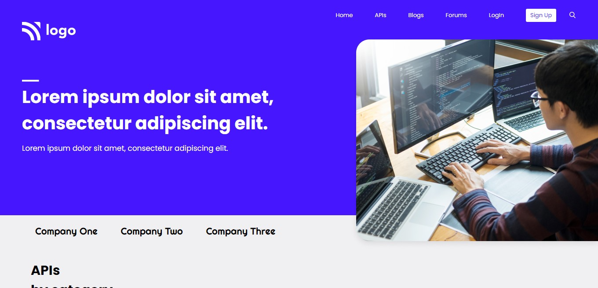

## ⭐Project 08- Web Design Page⭐

 

## 📌 Live Site URL: <a href="https://09developer-page.netlify.app/">**Visit Now**</a>

 

## 📌 Screenshot:

 

## 📌 What I Learned:

- ### Learned about box shadow
- ### Learned about Flexbox properties
- ### Learned about parent child relation in position property

 

## 📌 Time Taken To Complete This Project:

- ### It took me 5 hours to complete this project

 

## 📌 Social Links:

